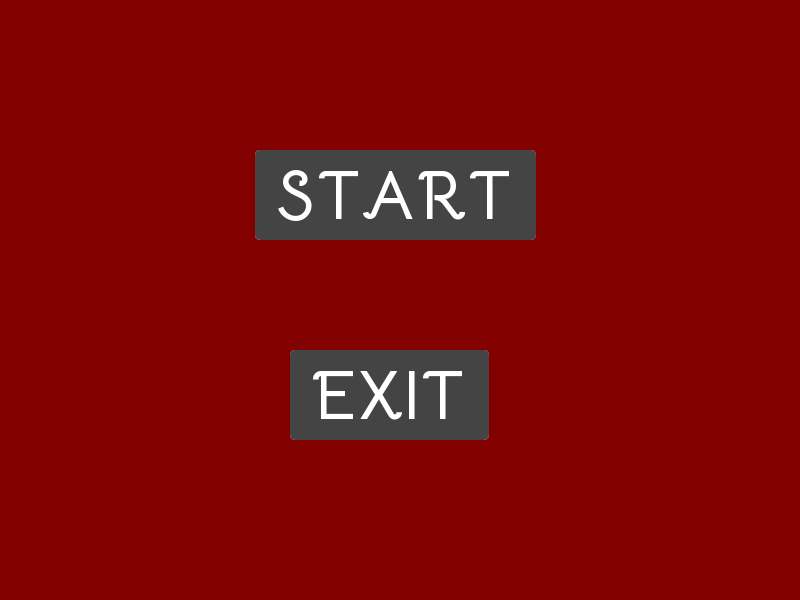
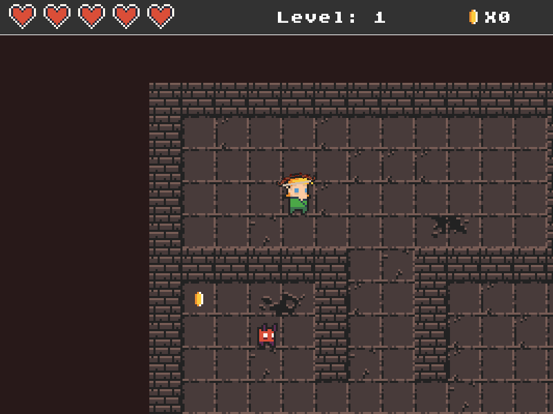
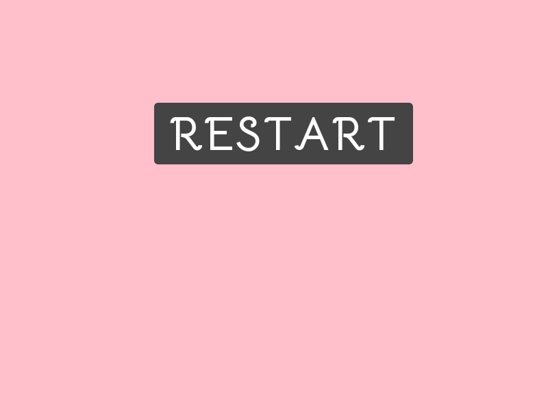

# Dungeon Crawler

A top-down pygame dungeon crawler built by following the Udemy course:
https://www.udemy.com/course/pygame-dungeon-crawler/

This repository is a course clone and learning project based on the course material. It is intended to document the implementation I followed while learning pygame game development.

## Credits

- Course: Pygame Dungeon Crawler by Code with Rusty on Udemy
- Base gameplay, structure, and many assets were created by following the course material

## Requirements

- Python 3.10+ recommended
- pygame

## Install

```bash
pip install -r requirements.txt
```

## Run

```bash
python main.py
```

## Screenshots

Add a few gameplay screenshots here to make the repository easier to browse on GitHub.

Example gallery (drop images into `assets/images/screenshots/`):

<div align="center">
	
	
	
</div>

If you do not have screenshots yet, create the folder `assets/images/screenshots/` and add PNGs named `main-menu.png`, `gameplay.png`, and `pause-screen.png`.
The repository currently includes these captures saved via the in-game F12 shortcut:

- `assets/images/screenshots/screenshot-20260525-145546.png`
- `assets/images/screenshots/screenshot-20260525-145638.png`
- `assets/images/screenshots/screenshot-20260525-145706.png`

How to capture screenshots

- Manual (Windows): run the game (`python main.py`), press `Alt+PrtSc` to capture the active window, paste into Paint, and save to `assets/images/screenshots/`.
- Automated (optional): add this snippet to the `pygame` event loop to save a screenshot when pressing `F12`:

```py
# inside the event loop, where `screen` is your display surface
if event.type == pygame.KEYDOWN and event.key == pygame.K_F12:
		import datetime
		ts = datetime.datetime.now().strftime("%Y%m%d-%H%M%S")
		pygame.image.save(screen, f"assets/images/screenshots/screenshot-{ts}.png")
```

Add screenshots that show: the title/main menu, active gameplay with the HUD visible, and either the pause or death screen. Those three images convey the game's flow to visitors.

## Controls

Move with `W`, `A`, `S`, `D`.
Press `Esc` to pause.
Use the mouse to click menu buttons.

## Notes

- This project was created as part of a course walkthrough.
- If you publish this publicly, make sure you are allowed to share any course-provided assets or code.
